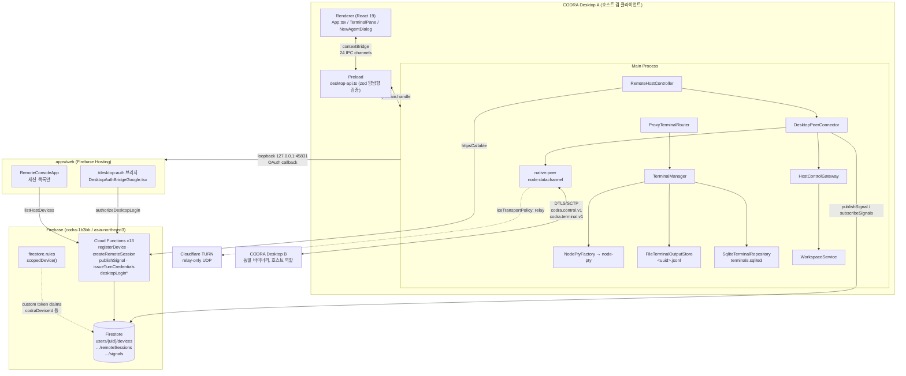

# CODRA 온보딩 & 개발 연속성 브리핑

> 기준 커밋: `4142a1c` (feat(desktop): launch agents on remote workspaces) · 워킹트리 clean · 2026-08-02

---

## 1. 프로젝트 한눈에 보기

**CODRA는 "CLI 도구와 여러 에이전트 세션을 운용하는 오퍼레이터 콘솔"이다.** macOS Electron 앱이 제품의 본체이고, 인증과 원격 접속은 워크스페이스가 아니라 **보조 컨트롤**이다 (`docs/superpowers/specs/2026-08-02-operator-console-ux-design.md`).

이 제품 정의는 이틀 사이에 두 번 바뀌었다. 최초 설계(`docs/superpowers/specs/2026-08-01-codra-remote-terminal-design.md`)는 "브라우저에서 내 Mac의 PTY에 붙는다"였고, 현재는 "**CODRA 데스크톱에서 다른 Mac의 CODRA에 에이전트를 띄운다**"이다. 브라우저 터미널 클라이언트는 착수되지 않았고, `apps/web`은 로그인 브리지 + 읽기 전용 세션 목록으로 축소됐다.

### 세 개의 레이어

| 레이어                                                                                | 상태                                               | 근거                                                                                                                           |
| ------------------------------------------------------------------------------------- | -------------------------------------------------- | ------------------------------------------------------------------------------------------------------------------------------ |
| **① 로컬 터미널** (PTY, 스크롤백, SQLite, 종료 시퀀스)                                | **완성·검증됨**. CI가 이것만 게이트한다            | `apps/desktop/src/main/terminal/**` 258개 desktop 테스트, `tests/e2e/standalone-terminal.spec.ts`, `packaged-terminal.spec.ts` |
| **② 원격 접속** (Firebase Auth/Functions/Firestore 시그널링 + WebRTC desktop↔desktop) | **동작 코드는 존재, E2E 검증 0, 라이브 배포 미완** | `apps/desktop/src/main/remote/**`, `functions/src/**`, `packages/webrtc`                                                       |
| **③ 에이전트 런타임** (codex/claude/gemini/ollama 설치·인증·실행)                     | **완성**, 단 패키징 스모크 미검증                  | `apps/desktop/src/main/terminal/agent-runtime.ts`                                                                              |

**성숙도 요약**: 로컬은 프로덕션 급, 원격은 "유닛 테스트로만 증명된 상태", 릴리스 파이프라인은 스크립트 4개가 아예 없어서 붕괴 상태.

---

## 2. 아키텍처

### 2.1 런타임 토폴로지



### 2.2 패키지별 책임

#### `apps/desktop` — Electron 본체 (전체 코드의 대부분)

**main/terminal** — 모든 로컬 프로세스의 소유자. 포트 3개(`PtyFactory`/`TerminalRepository`/`TerminalOutputStore`)로 분리되어 있어 `main/index.ts`만 Electron/node-pty/better-sqlite3를 직접 만진다.

| 파일                                 | LOC | 역할                                                                |
| ------------------------------------ | --- | ------------------------------------------------------------------- |
| `main/terminal/manager.ts`           | 464 | 세션 맵, 출력/디스크립터 직렬화 큐, 2단계 kill 상태머신             |
| `main/terminal/scrollback.ts`        | 434 | JSONL 스크롤백 + cursor 사이드카, 10 MiB 압축                       |
| `main/terminal/agent-runtime.ts`     | —   | `AGENT_PROFILES` (codex/claude/gemini/ollama), argv 구성, 모델 탐색 |
| `main/terminal/contracts.ts`         | 42  | 세 개의 포트. 로직 없음                                             |
| `main/index.ts`                      | 215 | 컴포지션 루트 — 여기가 유일한 DI 지점                               |
| `main/bootstrap.ts` / `lifecycle.ts` | —   | 크래시 복구(`markRunningExited(-1)`), 종료 순서 보장                |

핵심 타입: `TerminalSession`(manager.ts:96), `TerminalDescriptor`(protocol), `AgentCommand`(agent-runtime.ts:31).

**main/remote** — 원격 레이어 전부.

| 파일                               | LOC     | 역할                                                                              |
| ---------------------------------- | ------- | --------------------------------------------------------------------------------- |
| `remote/host-controller.ts`        | 532     | 두 개의 Firebase 런타임(account/device), login/activate, 30s heartbeat, 승인 서명 |
| `remote/desktop-peer-connector.ts` | **468** | 세션 생성/승인검증/협상 오케스트레이션 — **테스트 파일 없음**                     |
| `remote/host-control-gateway.ts`   | 640     | 호스트 측 제어 채널, scope 강제, AttachmentPump 관리                              |
| `remote/proxy-terminal-router.ts`  | 350     | origin 기준 로컬/원격 분기, 커서 연속성 강제                                      |
| `remote/workspace-service.ts`      | —       | roots/validate/list, realpath 정규화, 250 entry 캡                                |
| `remote/desktop-login.ts`          | —       | 루프백 OAuth + PKCE + 디바이스 서명 활성화                                        |
| `remote/host-identity.ts`          | —       | P-256 키쌍, safeStorage 암호화, RFC 7638 thumbprint                               |

**renderer** — React 19, 라우터/컨텍스트/스토어 **없음**. `App.tsx`(428줄)가 모든 교차 상태를 보유. 유일한 커스텀 훅은 `useTerminals.ts`. 모달은 `ModalDialog.tsx`(portal + native `<dialog>`) 하나만 공유.

#### `packages/protocol` — 유일한 계약 소스 (zod 4.4.3만 의존)

`remote.ts` 1189줄이 중심: `REMOTE_PROTOCOL_VERSION = 1`, 22-variant `RemoteControlMessageSchema`, 8-status 세션 상태머신(230줄 superRefine), 서명 도메인 6종. `remote-signing.ts`는 손으로 짠 SHA-256 + RFC 8785 canonical JSON + P-256 on-curve 검증. `terminal-frame.ts`는 34바이트 바이너리 헤더(`CDRF`).

#### `packages/webrtc` / `packages/firebase`

WebRTC 프리미티브(HandshakeGate, SignalVerifier, ice 정규화, AttachmentPump, ByteTokenBucket)와 Firestore 클라이언트(safeConverter로 Timestamp→millis 정규화, SignalSequenceCollector). **`packages/webrtc/src/channel.ts`의 peer 어댑터는 프로덕션 caller가 없다** — `apps/desktop/src/main/remote/native-peer.ts`가 같은 걸 다시 구현했다.

#### `functions` — 13개 엔드포인트, region `asia-northeast3`

`index.ts`(8 callable) + `desktop-login.ts`(4 endpoint) + `turn.ts`(1) + `auth.ts`(게이트 헬퍼) + `runtime.ts`(9줄 싱글턴).

#### `apps/web` — 두 개의 무관한 역할

`/desktop-auth`는 완성도 높은 Google OAuth 브리지지만 **프로덕션 caller가 없다**(데스크톱이 자체 루프백 플로우를 쓴다). 나머지 경로는 로그인 + 호스트 목록 + 세션 목록. UI 문구 전부 한국어. `@xterm/xterm`을 의존성에 선언했지만 import하는 소스가 없다.

---

## 3. 핵심 플로우

### (a) 로컬 터미널 생성 → PTY → 스크롤백 저장

```
renderer  App.tsx:? "New terminal" 클릭
   ↓ useTerminals.ts:42  create()
preload   desktop-api.ts  CreateTerminalRequestSchema.parse(req) → ipc.invoke("codra:terminal:create")
   ↓
main      ipc/terminal-ipc.ts:129  registrations[] → authorize(event) → admission.run(...)
   ↓
          remote/proxy-terminal-router.ts:103  request.target.kind === "local" → this.local.create()
   ↓
          terminal/manager.ts:96  create()
```

`manager.ts`의 순서는 **load-bearing**이다:

| 줄         | 동작                                                                                                       |
| ---------- | ---------------------------------------------------------------------------------------------------------- |
| `:111`     | `ptyFactory.spawn()` → `terminal/node-pty.ts:31` (cols 20..400, rows 5..200 클램프, `TERM=xterm-256color`) |
| `:126`     | `sessions.set(id, session)`                                                                                |
| `:129`     | `onExit` 구독                                                                                              |
| `:132`     | `onData` 구독 — 이 시점 이전 데이터는 `pendingOutput`에 버퍼링 (`handleData`, `:241`)                      |
| `:136`     | `await repository.save()` → `terminal/sqlite.ts` `terminals` 테이블 INSERT                                 |
| `:138-140` | `created = true` 후 `pendingOutput` 드레인                                                                 |
| `:141`     | `publishChanged()`                                                                                         |
| `:142-147` | 등록 중 이미 종료됐다면 `{kind:"native"}` finalization 시작                                                |

`:129`~`:141` 사이 throw는 `rollbackCreation`(`:391`)으로 전량 롤백된다.

출력 경로: `handleData` → `enqueueOutput`(`:260`)이 `session.outputTail`에 체이닝 → `scrollback.ts:129 append()` → 퍼-터미널 promise 큐(`:244`) → `<userData>/terminal-output/<uuid>.jsonl`에 `{"sequence":N,"data":"…","b":"…","e":"…"}` 1줄 추가 → `persistCursors`(`:358`)가 tmp+fsync+rename으로 `<uuid>.cursor.json` 전체 재작성 → `compact()`(`:398`).

종료: `startFinalization`(`:288`) → `pty.kill()` (SIGHUP) → `FINALIZATION_TIMEOUT_MS = 1_000`(`:19`) → `SIGKILL` → 또 1초 → `TerminalTerminationError`. **`await session.outputTail`(`:3단계`)로 마지막 청크 영속화 후에야 exited 디스크립터를 publish**한다.

### (b) 데스크톱 로그인 → 디바이스 활성화

```
renderer  AccountControl → SignInDialog "Google" 클릭
   ↓ codra:remote:login
main      ipc/remote-ipc.ts:238  authorize(event) → BrowserWindowLike를 parent로 전달
   ↓
          remote/host-controller.ts:191  login()  — authPromise + authGeneration 재진입 가드
   ↓
          remote/account-bootstrap-google.ts:22  provider === "google" 만 허용
   ↓
          remote/desktop-login.ts:581  bootstrapProductionDesktopAuth
```

1. `desktop-login.ts:262` 루프백 리스너 `127.0.0.1:45831/auth/callback` 바인드
2. Identity Toolkit `accounts:createAuthUri` POST (`providerId=google.com`, `authFlowType=CODE_FLOW`, `sessionId=state`)
3. `shell.openExternal`로 **시스템 브라우저** 오픈 (테스트가 `desktop-login.ts`에 `BrowserWindow|signInWithPopup` 문자열이 없음을 grep으로 강제 — `desktop-login.test.ts:510`)
4. 콜백 파싱 `parseDesktopLoginCallback`(`:162`): GET만, Host 정확 일치, 쿼리 allowlist `code,state,iss,scope,authuser,hd,prompt`
5. `accounts:signInWithIdp` → `signInWithCredential` → **계정 런타임(`codra-host`)에 Google 세션 확립**
6. `activate()`(`host-controller.ts:252`) → `startInternal`(`:341`):
   - `loadOrCreateHostIdentity`(`host-identity.ts:33`) → P-256 키, safeStorage 암호화, `<userData>/remote/host-identity.json` (0600)
   - `bootstrapProductionDesktopLogin`(`desktop-login.ts:651`): `desktopLoginStart`(디바이스 키 서명 + PKCE) → `authorizeDesktopLogin` callable(계정 토큰, `auth_time` 5분 신선도 강제 — `functions/src/desktop-login.ts:262`) → `desktopLoginRedeem`(code+state+nonce+PKCE+서명, 4×`timingSafeEqual`)
   - `DEVICE_NOT_FOUND` 시 `shouldRetryDesktopLoginAsRegister`(`:52`)로 register 재시도
   - `signInWithCustomToken(deviceRuntime.auth, token)` — **여기서 세션 정체성이 사람→디바이스로 바뀐다.** 이후 모든 callable은 `sign_in_provider === "custom"` + `codraDeviceId/KeyThumbprint/DeviceKind/DeviceGeneration` claim 요구 (`functions/src/auth.ts:115`)
   - 30초 `heartbeatDevice` 타이머(`HEARTBEAT_INTERVAL_MS`), `subscribePendingSessions` 구독, `{state:"online"}` publish

### (c) WebRTC 시그널링 → 피어 연결

**클라이언트(A)**:

1. `codra:agent:connect-target` → `remote-agent-client.ts:114 connectTarget()` — self-target 거부, 기존 피어 재사용, in-flight dedup
2. `desktop-peer-connector.ts:216 createSession()`: 대상이 `kind:"host" && active && remoteAccessEnabled && expiresAt > now`인지 확인 → `requestedScopes: [...REMOTE_AGENT_SCOPES]`(`host-control-gateway.ts:35-42`) → lease `min(15분, 8시간)` → `buildSessionRequestSigningPayload` 서명 → `createRemoteSession` callable
3. 서버(`functions/src/index.ts:238`)가 저장된 `publicKeyJwk`로 서명 재검증, 오프라인 호스트는 `HOST_OFFLINE`
4. `waitForApproval`(`:259`) — `min(120s, expiresAt-now)` 타임아웃

**호스트(B)**: 5. `subscribePendingSessions` 발화 → `main/index.ts:113` 한국어 `dialog.showMessageBox`, `requestedScopes.join(", ")` 나열 6. 승인 → `host-controller.ts:444 approveSession()` — `hostChallenge` 생성, `codra.session-approval.v1` 페이로드(sessionId, 양쪽 deviceId/thumbprint/generation, requested+approved scopes, 양쪽 challenge, expiresAt)에 서명 7. `acceptHostSession`(`desktop-peer-connector.ts:115`): `getSessionPeerDevice` → `assertPeerBinding` → `issueTurnCredentials` → `createPeer` → `DesktopPeerSession({role:"host"})`

**협상**: 8. 클라이언트가 두 채널(`codra.control.v1`, `codra.terminal.v1`, `{ordered:true}`)을 만들고 offer 생성 (`peer-session.ts:140`) 9. 모든 SDP/candidate는 `signal-transport.ts:121 publish()`가 `publishTail`로 직렬화 + 단조 `sequence` + `expiresAt = min(session.expiresAt, now+1h)` + 디바이스 키 서명 → `publishSignal` callable → `users/{uid}/remoteSessions/{sid}/signals/{negotiationId}-{senderDeviceId}-{sequence}`에 **`.create()`** (리플레이 시 ALREADY_EXISTS) 10. 수신측: `SignalSequenceCollector`(binding + 연속성) → `SignalVerifier.verify`(binding + generation + expiry + `sequence === expected+1` + 서명). `peer-session.ts:217-251`이 `ordered===false || maxRetransmits!=null || maxPacketLifeTime!=null` 채널을 거부

**인밴드 핸드셰이크**: 11. `remote-agent-client.ts:472 sendHello()` — `codra.hello.v1` 서명, 양쪽 challenge 포함 12. `host-control-gateway.ts:345 assertHelloBinding()` — Firestore 세션 문서와 10개 필드 완전 일치 검증 (`HELLO_SESSION_BINDING_MISMATCH`) 13. `HandshakeGate.acceptClientHello` → `hello_ack` + `helloTranscriptHash = canonicalPayloadDigest(서명된 hello)` 반환 14. 클라이언트가 transcript hash + 호스트 서명 검증(`packages/webrtc/src/handshake.ts:94`) → `authorized = true`. 15초 타임아웃

### (d) 원격 에이전트 실행 (workspace 선택 포함)

```
renderer  NewAgentDialog.tsx:204  selectTarget(remote device)
   ↓ codra:agent:workspace-roots   → peer.workspaceRoots()
   ↓ RemoteWorkspaceDialog.tsx     roots → breadcrumbs → entries
   ↓ codra:agent:workspace-validate → peer.workspaceValidate(path)
   ↓ "Launch" 클릭 → codra:terminal:create {target:{kind:"remote",…}, agent, cwd}
main      proxy-terminal-router.ts:103  target.kind === "remote"
   ↓ remoteHost.peerFor(target) → peer.launch(cwd, agent, cols, rows)
   ↓ control channel: {type:"agent.launch", requestId, cwd, cols, rows, agent}
host      host-control-gateway.ts:364  handleAuthorized
             requireScope("agent.launch")
             workspace.validate(message.cwd)     ← 호스트에서 cwd 재검증
             runtime 조회 → available / supportsYolo / modelRequired 확인
             manager.create({cols,rows,cwd:workspace.path,agent})
             owned.add(id); attach(id)
             → {type:"agent.ok", operation:"agent.launch", terminal}
```

이후 출력 흐름:

- PTY 출력 → `manager.onOutput` → `AttachmentPump.pump()`(`packages/webrtc/src/attachment-pump.ts:47`) → `readFromCursor(id, acknowledgedCursor, 16 KiB)` → `encodeOutputFrameBinary` → 터미널 채널
- 클라이언트 `proxy-terminal-router.ts:249 acceptFrame()`: `frameEnd <= nextCursor`면 재-ack 후 drop, 진짜 gap이면 세션 끊기, `TextDecoder({fatal:true,stream:true})` 실패도 끊기, 성공 시 `peer.acknowledge(id, frameEnd)`
- 호스트 `host-control-gateway.ts:532` → `pump.acknowledge(BigInt(cursor))` → `pump.pump()`

`ProxyTerminalRouter.create`(`:129`)가 로컬 `TerminalDescriptor`를 합성하며 `origin: request.target`을 붙이지만 — **렌더러는 이 필드를 읽지 않는다**(§8 참조).

---

## 4. 코드 지도

### 로컬 터미널 (main/terminal)

| 파일                                                  | LOC        | 역할                                                   |
| ----------------------------------------------------- | ---------- | ------------------------------------------------------ |
| `apps/desktop/src/main/terminal/manager.ts`           | 464        | 세션 생명주기, 출력/디스크립터 큐, 2단계 kill          |
| `apps/desktop/src/main/terminal/scrollback.ts`        | 434        | JSONL + cursor 사이드카, 10 MiB 압축, `readFromCursor` |
| `apps/desktop/src/main/terminal/agent-runtime.ts`     | ~560       | 4개 프로바이더 프로필, argv, 모델 탐색, npm setup      |
| `apps/desktop/src/main/terminal/node-pty.ts`          | ~60        | shell/agent/setup 분기, 크기 클램프                    |
| `apps/desktop/src/main/terminal/sqlite.ts`            | ~131       | WAL, `terminals` 단일 테이블                           |
| `apps/desktop/src/main/terminal/contracts.ts`         | 42         | 세 포트 정의                                           |
| `apps/desktop/src/main/index.ts`                      | 215        | 컴포지션 루트                                          |
| `apps/desktop/src/main/bootstrap.ts` / `lifecycle.ts` | ~135 / ~95 | 부트/종료 순서                                         |

### 원격 (main/remote)

| 파일                                                         | LOC                | 역할                                         |
| ------------------------------------------------------------ | ------------------ | -------------------------------------------- |
| `host-control-gateway.ts`                                    | 640                | 호스트 제어 채널, scope 강제, 에러 매핑      |
| `host-controller.ts`                                         | 532                | Firebase 2런타임, login/activate, 승인 서명  |
| `desktop-peer-connector.ts`                                  | **468**            | 세션 오케스트레이션 — **무테스트**           |
| `proxy-terminal-router.ts`                                   | 350                | 로컬/원격 분기, 커서 재조립                  |
| `remote-agent-client.ts`                                     | ~560               | 타깃 레지스트리 + 클라이언트 제어 채널       |
| `desktop-login.ts`                                           | ~820               | 루프백 OAuth + PKCE 활성화                   |
| `workspace-service.ts`                                       | ~250               | 워크스페이스 브라우저                        |
| `peer-session.ts` / `signal-transport.ts` / `native-peer.ts` | ~270 / ~200 / ~210 | 협상 / 서명 시그널 / node-datachannel 어댑터 |
| `auth-window.ts`                                             | 278                | **데드 코드** — 프로덕션 caller 없음         |

### 렌더러 / preload / IPC

| 파일                                     | LOC  | 역할                                |
| ---------------------------------------- | ---- | ----------------------------------- |
| `renderer/src/App.tsx`                   | 428  | 루트 + 12개 교차 상태               |
| `renderer/src/agent/NewAgentDialog.tsx`  | 592  | prompt-first 런처                   |
| `renderer/src/terminal/TerminalPane.tsx` | ~240 | xterm.js, replay→live 순서 상태머신 |
| `renderer/src/terminal/useTerminals.ts`  | ~110 | 유일한 커스텀 훅                    |
| `renderer/src/styles.css`                | 2260 | 단일 글로벌 스타일시트, dark-only   |
| `preload/desktop-api.ts`                 | 255  | 24채널 zod 양방향 검증              |
| `main/ipc/terminal-ipc.ts`               | ~270 | 10 handle + 2 push                  |
| `main/ipc/remote-ipc.ts`                 | ~250 | 12 handle + 3 push                  |
| `main/ipc/renderer-authorization.ts`     | ~40  | `assertAuthorizedRenderer`          |

### 공유 패키지 / 서버

| 파일                                      | LOC      | 역할                                                       |
| ----------------------------------------- | -------- | ---------------------------------------------------------- |
| `packages/protocol/src/remote.ts`         | **1189** | 프로토콜 전체                                              |
| `packages/protocol/src/remote-signing.ts` | 311      | SHA-256 / canonical JSON / P-256                           |
| `packages/protocol/src/remote-server.ts`  | 482      | 서버 문서 스키마 (7/11개 미사용)                           |
| `packages/protocol/src/terminal.ts`       | 341      | 터미널/에이전트/워크스페이스 스키마                        |
| `packages/protocol/src/terminal-frame.ts` | 101      | 34바이트 바이너리 프레임                                   |
| `functions/src/index.ts`                  | ~560     | 8 callable                                                 |
| `functions/src/desktop-login.ts`          | ~660     | 4 endpoint + 트랜잭션 상태머신                             |
| `firestore.rules`                         | 104줄    | `scopedDevice()` / `isSessionParticipant()` — **테스트 0** |

---

## 5. 계약 & 확장 지점

### 5.1 IPC 채널 (27개, `packages/protocol/src/desktop-api.ts:112-140`)

**agents (9)** — `codra:agent:list` · `setup` · `targets` · `connect-target` · `target-runtimes` · `workspace-roots` · `workspace-list` · `workspace-validate` · `targets-changed`(push)

**terminal (10)** — `codra:terminal:default-cwd` · `choose-cwd` · `list` · `create` · `write` · `resize` · `replay` · `close` · `output`(push) · `changed`(push)

**remote (8)** — `codra:remote:get-state` · `get-auth-state` · `login` · `logout` · `activate` · `deactivate` · `state`(push) · `auth-state`(push)

22 invoke + 5 push(`agentTargetsChanged`, `terminalOutput`, `terminalChanged`, `remoteState`, `remoteAuthState`). `ipcRenderer.send`도 `MessagePort`도 없다. (직접 세어 확인함)

### 5.2 원격 제어 프로토콜 (22 variant, `packages/protocol/src/remote.ts:969`)

| 그룹         | 메시지                                                                                                                    |
| ------------ | ------------------------------------------------------------------------------------------------------------------------- |
| 핸드셰이크   | `hello` · `hello_ack`                                                                                                     |
| 워크스페이스 | `workspace.roots` · `workspace.list` · `workspace.validate` → `workspace.ok`                                              |
| 에이전트     | `agent.runtimes` · `agent.launch` → `agent.ok`                                                                            |
| 터미널       | `terminal.list` · `create` · `attach` · `detach` · `write` · `resize` · `cursor_ack` → `terminal.ok` / `terminal.changed` |
| 에러         | `operation.error`(enum 코드) / `terminal.error`(**자유 문자열**)                                                          |
| 기타         | `ping` / `pong` / `session.close`                                                                                         |

바이트 한도: `CONTROL_MAX_UTF8_BYTES` 72 KiB · `TERMINAL_INPUT_MAX_UTF8_BYTES` 64 KiB · `TERMINAL_FRAME_MAX_BYTES` 16 KiB.

**스코프 어휘가 분열되어 있다** (프로토콜에 enum 없음, `remote.ts:44`는 그냥 `z.string()`):

- 데스크톱 클라이언트 요청: `workspace.read, agent.runtimes, agent.launch, terminal.write, terminal.resize, terminal.detach` (`host-control-gateway.ts:35-42`, 확인함)
- 웹 브리지 요청: `terminal.list, terminal.attach, terminal.write, terminal.resize` (`apps/web/src/remote/controller.ts:32-37`, 확인함)
- 게이트웨이가 `requireScope`하는 값에는 `terminal.list/create/attach`도 있음 → **`terminal.create` 브랜치는 도달 불가**

### 5.3 Firestore 컬렉션

| 경로                                                                                                                                                            | 스키마                                    | 쓰기 주체                                    |
| --------------------------------------------------------------------------------------------------------------------------------------------------------------- | ----------------------------------------- | -------------------------------------------- |
| `users/{uid}/devices/{deviceId}`                                                                                                                                | `RemoteDeviceSchema`                      | Functions만 (rules는 write 전면 deny)        |
| `users/{uid}/remoteSessions/{sessionId}`                                                                                                                        | `RemoteSessionSchema`                     | callable + **클라이언트 direct create 허용** |
| `.../signals/{negotiationId}-{sender}-{seq}`                                                                                                                    | `SignalSchema`                            | callable + **클라이언트 direct create 허용** |
| `serverDesktopLoginTransactions/{attemptId}`                                                                                                                    | 로컬 인터페이스 (프로토콜 스키마와 drift) | Functions                                    |
| `serverTurnIssuances/{id}`                                                                                                                                      | `TurnIssuanceSchema`                      | Functions                                    |
| `serverProofChallenges`, `serverBootstrapRateLimits`, `serverLiveTestRuns`, `serverDeviceSessionRegistries`, `serverTurnRateLimits`, `serverTurnRevocationJobs` | 스키마 존재                               | **아무도 안 씀**                             |

### 5.4 Cloud Functions (13개, region `asia-northeast3`)

| 이름                                                              | 트리거                                      | 인증                                                       |
| ----------------------------------------------------------------- | ------------------------------------------- | ---------------------------------------------------------- |
| `registerDevice`                                                  | onCall                                      | `requireAccount` (Google)                                  |
| `heartbeatDevice`                                                 | onCall                                      | device claims                                              |
| `createRemoteSession`                                             | onCall                                      | device claims + self-target 거부                           |
| `approveRemoteSession` / `rejectRemoteSession`                    | onCall                                      | device claims + `kind === "host"`                          |
| `listHostDevices`                                                 | onCall                                      | device claims                                              |
| `publishSignal`                                                   | onCall                                      | device claims + participant                                |
| `getSessionPeerDevice`                                            | onCall                                      | device claims                                              |
| `issueTurnCredentials`                                            | onCall + `secrets:[CLOUDFLARE_TURN_CONFIG]` | device claims                                              |
| `desktopLoginStart` / `desktopLoginRedeem` / `desktopLoginCancel` | **onRequest, cors:false**                   | 없음 (디바이스 서명으로 게이팅, `Origin` 헤더 있으면 거부) |
| `authorizeDesktopLogin`                                           | onCall                                      | Google + `auth_time` 5분 신선도                            |

### 5.5 새 remote operation 추가 체크리스트 (순서대로)

1. **`packages/protocol/src/remote.ts`** — 5곳 수정
   - 요청 스키마 (`.strict()`, `requestId` 필수, 모든 문자열/배열 bound) — `:797` 인근
   - `workspaceOk`(`:826`) 또는 `agentOk`(`:852`) discriminated union에 성공 variant 추가
   - `RemoteOperationNameSchema`(`:872`)에 리터럴 추가
   - 필요 시 `RemoteOperationErrorCodeSchema`(`:879`) 확장
   - **`RemoteControlMessageSchema` union 목록(`:969`)에 등록** ← 빠뜨리면 컴파일은 되고 런타임에만 실패
2. **`packages/protocol/test/remote.test.ts`** — accept 1건 + strict-rejection 1건 (관례)
3. **`apps/desktop/src/main/remote/host-control-gateway.ts`** — 5곳
   - `RemoteOperationName` 타입 union(`:28`) — 스키마의 수동 복제본
   - `REMOTE_AGENT_SCOPES`(`:35`) — 새 스코프 필요 시
   - `operationIdentity()` allowlist(`:120`) — 파싱 실패 메시지에 in-band 응답하는 경로
   - `operationForMessage()` switch(`:138`)
   - `handleAuthorized()` case(`:364`) — **첫 줄이 `this.requireScope(...)`**. `:544-552`의 direction switch가 exhaustive라 새 `*.ok` 타입 추가 안 하면 빌드 실패
4. **`apps/desktop/src/main/remote/remote-agent-client.ts`** — `workspaceRoots()`(`:315`) 형태로 메서드 추가. `response.type`과 `response.operation` 둘 다 확인, 불일치 시 `REMOTE_RESPONSE_OPERATION_MISMATCH`
5. **`apps/desktop/src/main/remote/host-controller.ts:136`** — `target.kind === "local"` → `hostServices`, else `remoteClient.peerFor(target)` 분기 추가
6. 렌더러 노출이 필요하면 → §5.6

### 5.6 새 IPC 추가 체크리스트 (순서대로)

1. **`packages/protocol/src/desktop-api.ts`** — `IPC_CHANNELS`(`:112`)에 `codra:<domain>:<kebab-verb>` 추가 + `CodraDesktopApi`(`:153`)에 메서드 추가 + `.strict()` 요청/응답 스키마
2. **`packages/protocol/test/desktop-api.test.ts`** — 채널명 freeze 어서션 추가 (기존 테스트가 채널 rename을 실패로 만든다)
3. **`apps/desktop/src/preload/desktop-api.ts`** — `Schema.parse(request)` → `ipc.invoke` → `Schema.parse(response)`. void 뮤테이션은 `assertUndefinedResponse`(`:39`). push는 `safeParse` + silent drop + wrapper 기준 unsubscribe
4. **`apps/desktop/src/main/ipc/terminal-ipc.ts:129`** 또는 **`remote-ipc.ts:161`** `registrations` 배열에 등록
   - 첫 줄 **반드시** `authorize(event)`
   - terminal 뮤테이션은 **반드시** `admission.run(...)`로 감싸기
   - ⚠️ **terminal-ipc에 추가하면 `requestChannels` 배열(`terminal-ipc.ts:72`)에도 추가해야 한다** — teardown이 `registrations`가 아니라 이 별도 배열을 순회한다. 빠뜨리면 핸들러가 leak
5. **포트 인터페이스 확장** — `TerminalManagerIpcPort`(`terminal-ipc.ts:43`) 또는 `RemoteHostControllerPort`(`remote-ipc.ts:36`)
6. **`apps/desktop/src/preload/desktop-api.test.ts`** — 기존 테스트가 `{channel, args}` 튜플을 정확히 어서션하므로 새 호출을 배열에 추가하지 않으면 깨진다

### 5.7 기타 확장 지점

- **새 에이전트 프로바이더**: `AgentKindSchema`(`terminal.ts:134`) → `AGENT_PROFILES`(`agent-runtime.ts:73`) → `managedAgentPackage`/`agentAuthenticationArgs`/`resolveAgentCommand` switch 3개. **모두 `default` 없는 exhaustive switch라 TS가 체크리스트 역할**. 렌더러는 데이터 구동이라 수정 불필요
- **스토리지 교체**: `terminal/contracts.ts`의 포트 구현 → `bootstrapDesktop`의 `createRepository`/`createOutputStore` 팩토리(`index.ts:154`). 원격 서빙하려면 `readFromCursor` 필수 (`TERMINAL_CURSOR_OUTPUT_UNAVAILABLE`)
- **터미널 연산 데코레이션**: `createTerminalRouter(manager)`(`bootstrap.ts:51`)가 지정된 seam. **단, `configureTerminalServices`는 라우터 이전에 로컬 매니저에 대해 실행된다** (`bootstrap.test.ts:107` 어서션) — 원격 호스트 서비스는 의도적으로 라우터를 우회
- **워크스페이스 정책**: `WorkspaceServiceOptions.rootCandidates` 주입 (테스트가 하는 방식이자 §8의 `/` 루트 문제를 고칠 방법)

---

## 6. 테스트 & 검증 체계

### 계층 1: vitest 유닛 (`pnpm test`) — 55 파일 / 338 테스트

| 패키지              | 파일 | 테스트  | 러너                   |
| ------------------- | ---- | ------- | ---------------------- |
| `packages/protocol` | 5    | 35      | `vitest run`           |
| `packages/webrtc`   | 7    | **9**   | `--passWithNoTests`    |
| `packages/firebase` | 2    | 7       | `--passWithNoTests`    |
| `functions`         | 6    | 26      | `--passWithNoTests`    |
| `apps/web`          | 1    | 3       | `--passWithNoTests`    |
| `apps/desktop`      | 34   | **258** | 2 프로젝트(node/jsdom) |

깊이 있는 곳: `manager.test.ts`(915줄, 30 케이스, 등록 에러·동기 exit·SIGKILL 승격·cause 우선순위까지), `scrollback.test.ts`(18 케이스, torn tail·UTF-8 미분할 압축·커서 재개), `terminal-ipc.test.ts`(648줄, trusted/untrusted sender 매트릭스), `desktop-login-transaction.test.ts`(631줄, in-memory Firestore로 전체 상태머신), `preload/desktop-api.test.ts`(501줄, 채널·인자 튜플 정확 어서션).

`node-pty.test.ts:156`은 **실제 `/bin/zsh`를 spawn**해서 패치된 `spawn-helper`가 동작함을 증명하는 유일한 자동 검증이다.

### 계층 2: Playwright + 실제 Electron (macOS 전용)

`playwright.config.ts` — `workers:1`, `retries:0`, `forbidOnly:true`(무조건), 3 프로젝트:

| 프로젝트                  | 스펙                                     | 실행 명령                                       |
| ------------------------- | ---------------------------------------- | ----------------------------------------------- |
| `dev-electron`            | `standalone-terminal.spec.ts` (3 테스트) | `pnpm test:e2e` (앞서 `pnpm build`)             |
| `packaged-electron`       | `packaged-terminal.spec.ts` (1 테스트)   | `pnpm test:packaged`                            |
| `packaged-native-modules` | `packaged-native-modules.spec.ts`        | **어떤 스크립트도 이 프로젝트를 선택하지 않음** |

`packaged-terminal.spec.ts`는 **스모크 영수증 체인**의 핵심: provenance/pending 짝 검증 → `archive-host-app.mjs`가 exit 1임을 확인 → Mach-O 아키텍처 확인 → 실제 앱 실행 → 셸 PID 회수 → `:221`에서 `pending → passed` rename.

### 계층 3: 독립 node:assert 스크립트 (러너 없음)

`scripts/test-functions-deploy-artifact.mjs`(2회 스테이징 바이트 동일성 + offline frozen-lockfile 설치), `test-live-test-guard.mjs`, `verify-firebase-indexes.mjs`, `verify-remote-build-config.mjs`, `verify-node-datachannel-package.mjs`.

### 정확한 실행 명령 & 전제조건

```bash
pnpm install --frozen-lockfile   # postinstall: electron-builder install-app-deps + spawn-helper chmod 0755
pnpm typecheck && pnpm lint && pnpm format:check && pnpm test    # OS 무관

pnpm test:e2e                    # macOS. 먼저 pnpm build 수행
pnpm --filter @codra/desktop package:dir && pnpm test:packaged && pnpm package:archive   # 반드시 이 순서
npx playwright test --project=packaged-native-modules            # 스크립트 없음, 수동 호출

pnpm firebase:emulators          # firebase-tools + Firestore 에뮬레이터용 JDK 필요
                                 # firebase.json의 functions.source = functions-deploy-build (생성물)
                                 # → 반드시 이 스크립트로. firebase emulators:start 직접 호출 불가
pnpm test:functions-deploy-artifact   # pnpm store에 fixture tarball warm 필요 (--offline 사용)
pnpm build:remote-test && pnpm package:remote-test && pnpm verify:native-package
```

**zsh 주의**: 이 셸에서 파이프 뒤 `${PIPESTATUS[0]}`는 빈 문자열이다(zsh는 `$pipestatus[1]`). exit code를 잡으려면 파일로 리다이렉트 후 `$?`를 읽어라.

### CI가 실행하는 것 (`.github/workflows/ci.yml`, 단일 job `standalone-macos`)

`lint → format:check → typecheck → test → build → test:e2e → package:dir → test:packaged → package:archive → CODRA-host.app.tar.gz 업로드`.

**CI가 실행하지 않는 것**: `verify:remote-build-config`, `verify:firebase-indexes`, `verify:native-package`, `test:functions-deploy-artifact`, `stage:functions-deploy`, `test:firebase-rules`, `firebase:emulators`, `build:remote-test`, `packaged-native-modules` 프로젝트, 모든 `scripts/test-*.mjs`. **원격 레이어 코드는 CI에서 단 한 줄도 실행되지 않는다.**

---

## 7. 현재 상태 (build health)

전 명령 실측 결과. **단 하나만 빨간불이다.**

| 명령                     | Exit     | 결과                                     |
| ------------------------ | -------- | ---------------------------------------- |
| `git status --porcelain` | 0        | **빈 출력** (워킹트리 clean, stash 없음) |
| `pnpm typecheck`         | 0        | 6/6 패키지 Done. TS 에러 0               |
| `pnpm lint` (`eslint .`) | **0**    | 출력 없음                                |
| `pnpm format:check`      | **1** ❌ | 아래 참조                                |
| `pnpm test`              | 0        | **55 files / 338 tests passed**, ~6초    |
| `pnpm build`             | 0        | 6 패키지 전부. 경고만(chunk size)        |

**유일한 실패 — `pnpm format:check`** (재확인함):

```
[warn] docs/superpowers/specs/2026-08-02-agent-target-workspace-design.md
[warn] Code style issues found in the above file. Run Prettier with --write to fix.
[ELIFECYCLE] Command failed with exit code 1.
```

diff는 91-92행 한 hunk. 코드 블록 안의 TS union을 prettier가 한 줄로 접길 원한다:

```diff
-  | { kind: "local" }
-  | { kind: "remote"; deviceId: string; displayName: string };
+  { kind: "local" } | { kind: "remote"; deviceId: string; displayName: string };
```

**CI 6번째 스텝이 여기서 죽으므로 현재 main은 red다.** `npx prettier --write` 한 번이면 끝난다.

**부수 확인**:

- `test-results/.last-run.json` = `{"status":"passed","failedTests":[]}` — 마지막 Playwright 실행은 통과했다. 실패 아티팩트 없음
- `firestore-debug.log`(gitignored, Aug 1) — 정상 기동/종료. 단 `127.0.0.1:18080`에 바인드됐는데 `firebase.json`은 8080이라 `pnpm firebase:emulators` 경로가 아닌 임시 하네스에서 나온 로그
- 툴체인: node **v22.22.3** (요구 `>=22.22.0`), pnpm **11.5.2** (`packageManager` 정확 일치), JDK 25.0.2
- 워크트리 4개 전부 clean. 단 `codex/standalone-{persistence,pty,renderer}`에 **머지 안 된 터미널/PTY 버그픽스 커밋 8개**가 main보다 77 커밋 뒤처진 채 남아있다

**빌드 산출물 경고** (에러 아님): `apps/web` 853.72 kB (gzip 255.79 kB), `apps/desktop` 렌더러 1,253.94 kB. 코드 스플리팅 미설정.

---

## 8. 미완성 작업 및 리스크

중복 제거 후 심각도순 통합 표. 여러 에이전트가 같은 문제를 지적한 항목은 병합했다.

| #   | 항목                                                                                                                                   | 위치                                                                                                                                  | 심각도    | 근거                                                                                                                                                                                                                                                                |
| --- | -------------------------------------------------------------------------------------------------------------------------------------- | ------------------------------------------------------------------------------------------------------------------------------------- | --------- | ------------------------------------------------------------------------------------------------------------------------------------------------------------------------------------------------------------------------------------------------------------------- |
| 1   | **`pnpm format:check` 실패 — CI red**                                                                                                  | `docs/superpowers/specs/2026-08-02-agent-target-workspace-design.md:91-92`                                                            | 🔴 High   | 직접 실행 확인. `ci.yml` 6번째 스텝                                                                                                                                                                                                                                 |
| 2   | **릴리스 스크립트 4개 부재** — `build:release-candidate`, `verify:release-candidate`, `scan:client-artifacts`, `verify:remote-release` | `package.json:21,22,33,35`                                                                                                            | 🔴 High   | `ls scripts/`로 부재 확인. 릴리스 파이프라인 전체 무력화. `docs/security/remote-baseline.json`은 존재하지 않는 스캐너용 stub                                                                                                                                        |
| 3   | **E2E 스펙 3개 부재** — `remote-direct`, `remote-reconnect`, `release-remote-disabled`                                                 | `package.json:26,27,34` vs `tests/e2e/`                                                                                               | 🔴 High   | `tests/e2e/`에 3개 스펙만 존재. **원격 레이어 E2E 커버리지 0**                                                                                                                                                                                                      |
| 4   | **Firestore rules 테스트 0건**                                                                                                         | `packages/firebase/package.json` `test:rules` = `vitest run --passWithNoTests`; `firestore.rules` 104줄                               | 🔴 High   | `@firebase/rules-unit-testing@5.0.1` 설치돼 있으나 importer 0. 인가 경계 전체가 미검증                                                                                                                                                                              |
| 5   | **호스트 게이트웨이 rate limiting 전무**                                                                                               | `packages/webrtc/src/token-bucket.ts` (caller 0, grep 확인); `host-control-gateway.ts:501`                                            | 🔴 High   | 인가된 피어가 `terminal.write`(64 KiB) / `workspace.list` / `agent.launch`를 무제한 호출 가능. 백프레셔는 출력 방향에만 존재                                                                                                                                        |
| 6   | **"bounded" 워크스페이스가 macOS/Linux에서 unbounded**                                                                                 | `workspace-service.ts:112-118` — `defaultRootCandidates`가 파일시스템 루트 `/` 반환                                                   | 🔴 High   | 직접 확인. `roots.some(containsPath)`가 모든 절대경로에 대해 참 → `WORKSPACE_OUTSIDE_ROOTS` 도달 불가, symlink escape 방어 무력화. 테스트는 `rootCandidates: [home]`을 주입해서 이 경로를 안 탄다                                                                   |
| 7   | **세션 승인이 all-or-nothing**                                                                                                         | `host-controller.ts:444-447`; `main/index.ts:113-129`                                                                                 | 🔴 High   | `approvedScopes = session.requestedScopes` 기본값, 다이얼로그는 스코프를 나열만. 스코프 축소 기계(서명·`requireScope`)는 완비됐으나 UI가 없음                                                                                                                       |
| 8   | **`useTerminals`의 `list()`에 `.catch` 없음**                                                                                          | `useTerminals.ts:69`                                                                                                                  | 🔴 High   | reject 시 `initialLoadPending`이 영원히 true, 사이드바가 "No terminals"로 고착, 에러 표면 없음. 3줄 위 `defaultCwd()`는 catch 있음                                                                                                                                  |
| 9   | **`desktop-peer-connector.ts`(468줄) 테스트 0**                                                                                        | `apps/desktop/src/main/remote/desktop-peer-connector.ts`                                                                              | 🔴 High   | `.test.ts` 없음(확인). 세션 생성·승인 서명 검증·peer binding·협상 두 경로 전부 미검증. 플랜 자체 규칙("모든 동작 변경은 실패 테스트로 시작") 위반                                                                                                                   |
| 10  | **`FileTerminalOutputStore.append`가 청크당 O(파일크기)**                                                                              | `scrollback.ts:129-157, 296-311, 358-384, 398`                                                                                        | 🔴 High   | 매 append마다 전체 jsonl 재읽기 + 커서 사이드카 전체 재작성 + fsync + stat. 10 MiB 한도에서 CPU/fsync 모두 quadratic. `outputTail`에 직렬화돼 있어 터미널이 눈에 띄게 렉                                                                                            |
| 11  | **스크롤백/메타데이터 GC 전무**                                                                                                        | `scrollback.ts:222` (`remove()` caller 0); `sqlite.ts:48-89` (DELETE 없음)                                                            | 🔴 High   | 열었던 모든 터미널의 `<uuid>.jsonl`(최대 10 MiB씩)이 영구 누적. `codra:terminal:list`는 모든 과거 행 반환                                                                                                                                                           |
| 12  | **웹 클라이언트가 실제로 연결 불가**                                                                                                   | `apps/web/src/remote/controller.ts:106-154`                                                                                           | 🔴 High   | `RTCPeerConnection`·`issueTurnCredentials`·`subscribeSignals`·`publishSignal`·`HandshakeGate` 어느 것도 `apps/web/src`에 없음. `@xterm/xterm` 의존성만 선언됨                                                                                                       |
| 13  | **`/desktop-auth` 브리지에 프로듀서 없음**                                                                                             | `apps/web/src/remote/DesktopAuthBridgeGoogle.tsx` (287줄, 완성·테스트됨)                                                              | 🔴 High   | 데스크톱은 자체 루프백 OAuth 사용(`desktop-login.ts:770`). `auth-window.ts`의 allowlist에 `/desktop-auth` 없음. 가장 잘 다듬어진 코드가 데드                                                                                                                        |
| 14  | **원격 세션이 서버 측에서 종료되지 않음**                                                                                              | `functions/src/index.ts`; `packages/protocol/src/remote-server.ts:448`                                                                | 🔴 High   | `signaling/connected/disconnected/closed/failed` 상태를 쓰는 Function 없음, rules는 client update deny. `createExpiredSessionCleanup`은 caller 0. 만료 세션이 Firestore에 영구 잔존                                                                                 |
| 15  | **App Check 완전 비활성**                                                                                                              | `deployment.ts:51,81,128,143` (`authAppCheckEnforcement: z.literal(false)`); `packages/firebase/src/index.ts` (app-check import 없음) | 🟠 Medium | `desktopAppCheckFirebaseAppId`는 regex 검증만 될 뿐 `initializeAppCheck` 호출 없음. 모든 callable이 유효 토큰만 있으면 어느 클라이언트에서든 도달 가능                                                                                                              |
| 16  | **rules가 클라이언트 direct session/signal create 허용**                                                                               | `firestore.rules:48-66, 82-90`                                                                                                        | 🟠 Medium | `validSessionRequest`가 `requestSignature`를 검증 못함(rules는 ECDSA 불가). 호스트는 Firestore 스냅샷으로 승인하며 서명을 재검증하지 않음(`host-controller.ts:443`). 스키마 위반 문서를 넣으면 `safeConverter.fromFirestore`가 throw해 호스트 리스너를 죽일 수 있음 |
| 17  | **종료가 영구 wedge될 수 있음**                                                                                                        | `lifecycle.ts:81-90`                                                                                                                  | 🟠 Medium | `closeAll` 성공 후 `closeRemoteHost`/`closeDatabase`/`unregisterIpc`가 throw하면 `quitting`이 false로 남고 admission gate가 영구 close → 모든 터미널 IPC가 `TerminalShutdownError`                                                                                  |
| 18  | **`registerRemoteIpc` teardown 클로저 폐기**                                                                                           | `main/index.ts:131`                                                                                                                   | 🟠 Medium | 12개 핸들러 + 3개 구독이 제거되지 않음. 두 번째 `startPrimaryInstance()`는 중복 handle로 throw                                                                                                                                                                      |
| 19  | **`TerminalSession`이 finalization 후 맵에서 제거 안 됨**                                                                              | `manager.ts:126` (set), `:399` (유일한 delete)                                                                                        | 🟠 Medium | 종료된 터미널마다 디스크립터·promise 2개·pendingOutput이 프로세스 수명 내내 잔존                                                                                                                                                                                    |
| 20  | **`ProxyTerminalRouter` 원격 세션 누수**                                                                                               | `proxy-terminal-router.ts:193-224, 249-256`                                                                                           | 🟠 Medium | `remoteSessions`/`remoteTerminalIds` 항목 삭제 없음. 최대 1 MiB replay 캐시가 앱 수명 내내 상주                                                                                                                                                                     |
| 21  | **`session.close`가 호스트 자원을 남김**                                                                                               | `host-control-gateway.ts:539`; `desktop-peer-connector.ts:182`                                                                        | 🟠 Medium | 게이트웨이만 닫히고 `DesktopPeerSession`·PeerConnection·SignedSignalTransport·Firestore 리스너·`gateways` 항목 존치                                                                                                                                                 |
| 22  | **클라이언트 전용 모드 없음**                                                                                                          | `host-controller.ts:87-104, 341-434`                                                                                                  | 🟠 Medium | `RemoteAgentClient.enabled()`가 `status === "online"`을 요구 → 외부 접속하려면 반드시 자기도 inbound 세션을 받는 호스트로 등록돼야 함                                                                                                                               |
| 23  | **`subscribeSignals`가 캐시 스냅샷을 검사 안 함**                                                                                      | `packages/firebase/src/index.ts:395-410`                                                                                              | 🟠 Medium | `metadata.fromCache` 미확인. 부분 캐시 스냅샷이 `SIGNAL_SEQUENCE_GAP`를 던지면 `DesktopPeerSession.fail`로 전파 → 세션 전체 파괴, 재동기 경로 없음                                                                                                                  |
| 24  | **`AttachmentPump`가 항상 `acknowledgedCursor`부터 재읽기**                                                                            | `packages/webrtc/src/attachment-pump.ts:54-58, 76-77`                                                                                 | 🟠 Medium | `sentCursor`를 추적하지만 읽지 않음. ack RTT 동안 같은 ≤16 KiB를 반복 전송. 수신측이 조용히 버려서 correctness는 OK지만 relay-only TURN에서 대역폭 낭비                                                                                                             |
| 25  | **`AttachmentPump.pump()`가 in-flight 중 wake-up 유실**                                                                                | `attachment-pump.ts:47, 81-83`                                                                                                        | 🟠 Medium | `pumping` true면 조용히 return, `finally` 후 재확인 없음. 다음 무관한 이벤트까지 출력 정지 가능                                                                                                                                                                     |
| 26  | **16 KiB 읽기 캡 때문에 백프레셔 기계가 사실상 데드**                                                                                  | `attachment-pump.ts:7-8, 54-58`                                                                                                       | 🟠 Medium | 1 MiB 하이워터마크에 도달할 수 없음 → `paused`/`onBufferedAmountLow` 경로 미동작                                                                                                                                                                                    |
| 27  | **`HandshakeGate.verifyHello`가 `signer` 확인 전에 `peerVerified=true`**                                                               | `packages/webrtc/src/handshake.ts:73 vs 81-82`                                                                                        | 🟠 Medium | signer 없는 호스트 게이트는 `acceptClientHello`가 throw해도 이미 `authorized === true`. fail-open 순서                                                                                                                                                              |
| 28  | **malformed 라인 하나가 터미널 스크롤백을 영구 오염**                                                                                  | `scrollback.ts:88-98, 274-294`                                                                                                        | 🟠 Medium | `parseCompleteRecords`가 throw → append/readAfter/readFromCursor/nextSequence 전부 차단. 격리·재구축 경로 없음                                                                                                                                                      |
| 29  | **2단계 kill 고정 1초**                                                                                                                | `manager.ts:19, 322-344`; `lifecycle.ts:81-90`                                                                                        | 🟠 Medium | SIGHUP 무시 + 일시적 uninterruptible I/O → `TerminalTerminationError` → `closeAll` reject → 사용자가 종료를 확인했는데 앱이 안 나감                                                                                                                                 |
| 30  | **`terminal.cursor_ack`만 scope 검사 없음**                                                                                            | `host-control-gateway.ts:530-535`                                                                                                     | 🟡 Low    | attach + range 검증만. `workspace.read`만 승인된 세션도 커서 ack 구동 가능                                                                                                                                                                                          |
| 31  | **`RemoteAgentClient.enabled()`의 device 가드가 공허**                                                                                 | `host-controller.ts:88-91`                                                                                                            | 🟡 Low    | `this.deviceRuntime?.auth.currentUser !== null`은 `deviceRuntime`이 undefined일 때 true                                                                                                                                                                             |
| 32  | **에러 리포팅이 중복·붕괴**                                                                                                            | `App.tsx:162-168, 200-204`; `NewAgentDialog.tsx:214-224, 549-551`                                                                     | 🟠 Medium | `changeAgentTarget`이 `agentError` 설정 후 rethrow → 다이얼로그도 `targetError` 설정, 렌더는 `error ?? targetError`로 하나를 버림. 런치 실패는 `AGENT_CLI_NOT_FOUND` 외 전부 "The agent could not be started."                                                      |
| 33  | **`AGENT_SETUP_IN_PROGRESS` 문자열 매칭 의존**                                                                                         | `App.tsx:230-238` ↔ `terminal-ipc.ts:166`                                                                                             | 🟠 Medium | 타입 있는 에러 채널도, setup 완료 이벤트도 없음. main 측 문구 변경 시 UI가 조용히 열화                                                                                                                                                                              |
| 34  | **`TerminalDescriptor.origin`이 렌더러에서 미사용 + DB에 컬럼 없음**                                                                   | `App.tsx:354-359`; `sqlite.ts:18-33`; `proxy-terminal-router.ts:129`                                                                  | 🟠 Medium | 로컬/원격 pane을 구별할 UI 없음(status strip은 `"local"` 하드코딩). `terminals` 테이블에 origin 컬럼 없어 better-sqlite3가 조용히 무시                                                                                                                              |
| 35  | **`vitest`가 `dist/`의 컴파일된 테스트 중복 수집**                                                                                     | `functions/package.json`, `packages/firebase/package.json` (vitest config 없음)                                                       | 🟠 Medium | 빌드 후 functions 6파일(=4소스+2 dist), firebase 2파일. stale dist가 삭제된 테스트를 계속 통과시킴                                                                                                                                                                  |
| 36  | **4/6 패키지가 `--passWithNoTests`**                                                                                                   | `packages/webrtc`, `packages/firebase`, `functions`, `apps/web`                                                                       | 🟡 Low    | glob 파손 시 green. `packages/webrtc`는 7파일 9테스트로 이미 증상                                                                                                                                                                                                   |
| 37  | **`packaged-native-modules` 프로젝트 고아**                                                                                            | `playwright.config.ts:24-27`                                                                                                          | 🟠 Medium | 어떤 스크립트도 선택 안 함. node-pty 패치 + better-sqlite3/node-datachannel 감안하면 릴리스에서 가장 깨지기 쉬운 부분이 미실행                                                                                                                                      |
| 38  | **release 경로(`package:mac`)에 스모크 게이트 없음**                                                                                   | `scripts/package-macos.mjs:30-38, 78, 91`                                                                                             | 🟠 Medium | `--release`는 dist 전체 삭제 + pending 영수증 미작성 → `package:archive`가 항상 실패. DMG/ZIP은 스모크·mode 검증 없이 나감                                                                                                                                          |
| 39  | **머지 안 된 워크트리 버그픽스 8커밋**                                                                                                 | `.worktrees/wave-{persistence,pty,renderer}`                                                                                          | 🟠 Medium | 전부 터미널/PTY 수정, 각각 main보다 77 커밋 뒤. `codex/standalone-electron`은 0 ahead라 정리 가능                                                                                                                                                                   |
| 40  | **README.md가 사실과 다름**                                                                                                            | `README.md:3, 50-52`                                                                                                                  | 🟠 Medium | "does not require an account or login", "Firebase … deferred to a future phase" — 세 서브시스템 모두 출하됨. login-bridge 플랜 Task 5가 README 수정을 명시했으나 미실행                                                                                             |
| 41  | **`docs/runbooks/remote-access.md` 부재**                                                                                              | `docs/runbooks/` (3개만 존재)                                                                                                         | 🟠 Medium | 로그인 브리지·호스트 활성화·디바이스 등록 운영 문서 전무                                                                                                                                                                                                            |
| 42  | **283개 체크박스 중 0개 체크**                                                                                                         | `docs/superpowers/plans/*.md`                                                                                                         | 🟠 Medium | 완료 플랜조차 미체크. 유일한 ledger인 `.superpowers/sdd/*/progress.md`는 gitignored. 진행 상황을 git log에서 역산해야 함                                                                                                                                            |
| 43  | **TURN 발급 캡·폐기 없음**                                                                                                             | `functions/src/turn.ts:127-142`                                                                                                       | 🟠 Medium | `MAX_ACTIVE_TURN_ISSUANCES_PER_SESSION = 12`는 참조 0. `revokeTurnCredentials` 미존재. `serverTurnIssuances`가 항상 `status:"active"`라 TTL도 안 걸림                                                                                                               |
| 44  | **`publishSignal`이 caller 제어 `negotiationId`로 문서 경로 생성**                                                                     | `functions/src/index.ts:505-507`                                                                                                      | 🟠 Medium | `z.string().min(1).max(4096)`. `/` 포함 시 홀수 세그먼트 경로 → `adminDb.doc()` throw(500). 현재는 정상 클라이언트가 `sessionId`를 넣어서 잠복                                                                                                                      |
| 45  | **`desktopLoginRedeem`이 `remoteAccessEnabled: true` 강제**                                                                            | `functions/src/desktop-login.ts:575-590`                                                                                              | 🟠 Medium | `set()`(merge 아님). `resume` 로그인이 사용자가 끈 원격 접속을 조용히 재활성화                                                                                                                                                                                      |
| 46  | **`terminal.error` 코드가 자유 문자열**                                                                                                | `remote.ts:933` vs `:879`                                                                                                             | 🟡 Low    | `operation.error`는 enum인데 이쪽은 `z.string().max(64)`. `TERMINAL_NOT_ATTACHED` 등이 관례상 계약                                                                                                                                                                  |
| 47  | **프로토콜 버전 협상 없음**                                                                                                            | `remote.ts:23, 259, 647, 666, 685, 705`                                                                                               | 🟠 Medium | `z.literal(1)`이 5곳에 박혀 있어 bump가 즉시 하드 브레이크. hello/hello_ack에 min/max 지원 버전 교환 없음                                                                                                                                                           |
| 48  | **`packages/webrtc/src/channel.ts` 데드 코드**                                                                                         | `channel.ts:26-243` vs `native-peer.ts:33-203`                                                                                        | 🟠 Medium | 같은 안전 검사의 두 갈래 사본. channel.ts는 `relayType===TurnUdp` 검사 + `module.cleanup()` 호출, native-peer.ts는 둘 다 없음                                                                                                                                       |
| 49  | **`auth-window.ts`(278줄) 데드**                                                                                                       | `auth-window.ts:164`                                                                                                                  | 🟠 Medium | non-test importer 0. `account-bootstrap-google.test.ts:76,101`이 호출되지 않음을 명시적으로 어서션                                                                                                                                                                  |
| 50  | **`@codra/remote-safe-storage` 바인딩 유명무실**                                                                                       | `safe-storage-{electron,test-only}.ts`; `host-identity.ts:4`                                                                          | 🟠 Medium | 아무도 import 안 함. `host-identity.ts`가 `electron`에서 직접 `safeStorage`를 가져와 remote-test 빌드에서 stub 불가                                                                                                                                                 |
| 51  | **remote-test 웹 번들이 서빙 불가**                                                                                                    | `firebase.json` `hosting.public: apps/web/dist` vs `apps/web/vite.remote-test.config.ts:6` (`dist-remote-test`)                       | 🟠 Medium | 에뮬레이터 hosting(5000)이 **프로덕션** 웹 번들을 서빙. 수동 firebase.json 편집 필요, 문서 없음                                                                                                                                                                     |
| 52  | **`VITE_CODRA_REMOTE_TEST_EMAIL/PASSWORD` 미문서화**                                                                                   | `apps/web/src/remote/account-bootstrap-test-only.ts:10-15`                                                                            | 🟠 Medium | `.env.example` 없음, 런북 없음. 현재 `build:remote-test` 번들은 모든 로그인을 `REMOTE_TEST_EMAIL_AND_PASSWORD_REQUIRED`로 거부                                                                                                                                      |
| 53  | **`listAgentRuntimes`가 매 IPC마다 하위 프로세스 spawn**                                                                               | `agent-runtime.ts:163-172, 376-419`                                                                                                   | 🟡 Low    | `codex debug models` + `ollama list` (4초 타임아웃) + PATH 스캔. 캐싱/디바운스 없음                                                                                                                                                                                 |
| 54  | **죽은 bootstrap 훅 `startRemoteHost`**                                                                                                | `bootstrap.ts:57, 125-130`; `index.ts:146-204`                                                                                        | 🟠 Medium | 선언·사용되나 공급자 없음. 원격 호스트는 `codra:remote:activate` IPC로만 활성화                                                                                                                                                                                     |
| 55  | **`sendToLiveWindows` 4중 복제**                                                                                                       | `terminal-ipc.ts:85-108`; `remote-ipc.ts:77-150`                                                                                      | 🟡 Low    | 신뢰 검사 강화 시 4곳 동시 수정 필요                                                                                                                                                                                                                                |
| 56  | **~110줄 데드 CSS**                                                                                                                    | `styles.css:1232-1302, 1381-1433, 1493-1539`                                                                                          | 🟡 Low    | `.agent-workdir-*`, `.agent-runtime-summary`, `.agent-yolo-row` 등 어느 .tsx에도 없음                                                                                                                                                                               |
| 57  | **`apps/web` UI가 한국어 전용**                                                                                                        | `apps/web/src/App.tsx:29-60`                                                                                                          | 🟡 Low    | 데스크톱·스펙은 영어. 로컬라이제이션 방침 부재                                                                                                                                                                                                                      |
| 58  | **`firestore-debug.log` / 빈 `functions-deploy/functions-deploy/` 잔여물**                                                             | 리포 루트                                                                                                                             | 🟡 Low    | gitignored지만 stale                                                                                                                                                                                                                                                |

---

## 9. 다음 개발 후보

### 순위 1 — ⭐ 추천: `format:check` 수정 + 최신 플랜 Task 8 완료

**무엇을**

1. `npx prettier --write docs/superpowers/specs/2026-08-02-agent-target-workspace-design.md` (CI red 해소, 30초)
2. `docs/superpowers/plans/2026-08-02-agent-target-workspace.md:333-365` Task 8 실행 — 로그인 콜백 페이지를 완성형으로 교체

**왜**

- 이 프로젝트는 **플랜을 엄격히 순서대로 실행**한다(모든 선행 플랜에서 검증됨). Task 7까지 `4142a1c`로 닫혔고 트리는 clean 상태 — 정확히 태스크 경계에 서 있다.
- Task 8은 남은 두 태스크 중 **외부 의존이 없는 유일한 것**이다. Task 9는 에뮬레이터, 두 개의 디바이스 프로필, Firebase 배포, 그리고 존재하지 않는 테스트 파일 3개가 필요하다.
- 현재 갭이 구체적이고 작다. `desktop-login.ts:37-38`을 직접 확인했다:
  ```
  const CALLBACK_SUCCESS_HTML = `<!doctype html>…<body><p>You can return to CODRA.</p></body></html>`;
  ```
  CSP 없음, 스크립트 없음, 버튼 없음, 부모 창 refocus 없음. 플랜이 요구하는 것: 명확한 완료 상태 / 자동 `window.close()` 시도 / `Return to CODRA` 폴백 버튼 / 브라우저가 닫기를 막을 때의 안내 / 제한적 CSP + 원격 자산 0 / Electron parent `restore/show/focus` + `app.focus()`.
- CI가 red인 채로 다른 작업을 얹으면 다음 사람이 "내가 깼나?"를 먼저 조사하게 된다.

**손대야 할 파일** (플랜이 명시한 정확한 목록)

- `apps/desktop/src/main/remote/desktop-login.ts` + `.test.ts`
- `apps/desktop/src/main/remote/account-bootstrap-google.ts` + `.test.ts`

**게이트**: `pnpm --filter @codra/desktop test -- desktop-login account-bootstrap-google` && `pnpm --filter @codra/desktop typecheck` → `git commit -m "fix(auth): improve browser return to CODRA"`

**난이도**: 낮음 (0.5~1일). 기존 테스트가 `desktop-login.ts`에 `BrowserWindow|signInWithPopup` 문자열이 없어야 함을 grep으로 강제하므로(`desktop-login.test.ts:510`), 인라인 스크립트만 쓰고 임베디드 브라우저를 도입하지 않도록 주의.

---

### 순위 2 — `desktop-peer-connector.ts` 테스트 작성 + 워크스페이스 루트 봉인

**무엇을**

- `desktop-peer-connector.test.ts` 신규: `createSession` 서명, `verifyApproval`, `assertPeerBinding`, `waitForApproval` 타임아웃, host/client 두 협상 경로
- `workspace-service.ts:107-132`의 `defaultRootCandidates`가 `/` 대신 `$HOME` + 명시적 허용 볼륨만 반환하도록 수정

**왜**

- #9(468줄 무테스트)와 #6(`/`가 루트라 containment 검사가 no-op)은 **원격 레이어에서 가장 큰 두 구멍**이고, 둘 다 다른 작업을 블록하지 않는다.
- #6은 보안 갭이면서 동시에 UX 갭이다 — 원격 사용자에게 상대 머신의 전체 파일시스템이 노출된다. 수정은 `WorkspaceServiceOptions.rootCandidates`를 좁히는 것뿐이고, **테스트가 이미 그 방식으로 주입하고 있다**(`workspace-service.test.ts:107-109`).
- Task 9가 결국 이 코드를 E2E로 밟게 되므로 그 전에 유닛 레벨을 깔아두면 디버깅 비용이 크게 준다.

**손대야 할 파일**: `apps/desktop/src/main/remote/desktop-peer-connector.ts`(+신규 `.test.ts`), `workspace-service.ts:107-132`, `workspace-service.test.ts`

**난이도**: 중 (2~3일). 커넥터 테스트는 `PeerConnectionPort`/`PeerSignalPort` 페이크가 필요하지만 `peer-session.test.ts`가 그 패턴을 이미 확립했다.

---

### 순위 3 — Task 9의 선행조건 구축 (E2E 인프라)

**무엇을**

- `tests/e2e/remote-agent-workspace.spec.ts` 신규 (플랜 Task 9 Step 1이 요구)
- `playwright.config.ts`에 대응 프로젝트 추가 (**프로젝트별 `testMatch` 방식이라 파일만 넣으면 절대 실행되지 않는다**)
- `scripts/scan-client-artifacts.mjs` 작성 — Task 9 Step 2 게이트가 이걸 호출하므로 현재 게이트는 **원리적으로 통과 불가**
- 선택: `remote-direct.spec.ts` / `remote-reconnect.spec.ts` (실은 폐기된 remote-access 플랜 Task 10/11 소유물)

**왜**

- Task 9는 현재 **작성된 그대로는 실행 불가능**하다(#2, #3 확인). 누군가 Task 9를 집으면 첫 30분 안에 이 사실을 발견한다.
- 두 개의 원격 프로필을 띄우려면 `pnpm build:remote-test` → `dist-remote-test` 경로가 필요한데 `firebase.json`의 `hosting.public`이 `apps/web/dist`로 하드코딩돼 있다(#51). 이것부터 풀어야 한다.

**손대야 할 파일**: `tests/e2e/`, `playwright.config.ts`, `scripts/scan-client-artifacts.mjs`(신규), `firebase.json` 또는 스테이징 스크립트

**난이도**: 높음 (1주+). 두 Electron 인스턴스 + Firebase 에뮬레이터 + JDK 오케스트레이션.

---

### 순위 4 — 스크롤백 성능 + GC

**무엇을**

- `scrollback.ts append()`를 증분화: `nextSequences` 캐시처럼 커서 상태를 메모리에 유지하고 사이드카는 N개 append마다 또는 종료 시에만 flush
- `remove(terminalId)`(현재 caller 0) + `SqliteTerminalRepository.delete()`를 붙여 보존 정책 구현

**왜**

- #10과 #11은 사용자가 **실제로 체감하는** 유일한 성능 문제다. 빌드 로그를 쏟아내는 에이전트 세션이 코어 하나를 점유하고 터미널이 렉 걸린다. `outputTail`에 직렬화돼 있어 지연이 그대로 화면에 나타난다.
- 회귀 위험이 낮다 — `scrollback.test.ts`가 18 케이스(torn tail, UTF-8 미분할 압축, 커서 재개, 오버사이즈 거부)로 계약을 잘 고정하고 있다.

**손대야 할 파일**: `apps/desktop/src/main/terminal/scrollback.ts`, `sqlite.ts`, `manager.ts`(close 시 remove 호출), 각 `.test.ts`

**난이도**: 중 (2~3일). 단, 커서 인코딩이 `byteLimit >= 1024` 게이트에 묶여 있음(#`scrollback.ts:143,413`)을 주의.

---

### 순위 5 — Firestore rules 테스트 도입

**무엇을**: `packages/firebase`의 `test:rules`를 실제 에뮬레이터 대상 vitest 프로젝트로 교체. `scopedDevice()` 세대 기반 폐기, `isSessionParticipant()`, `validSessionRequest()` 커버.

**왜**: #4 — 인가 경계 전체가 미검증인데 **환경은 이미 완비**돼 있다(`@firebase/rules-unit-testing@5.0.1` + `firebase-tools@15.25.1` 루트 devDep, JDK 25, 캐시된 에뮬레이터 JAR). 시작 비용이 거의 0이다. #16(rules가 서명 미검증 direct create 허용)의 정확한 위험도도 이 테스트가 있어야 판정된다.

**손대야 할 파일**: `packages/firebase/package.json`, 신규 `packages/firebase/test/rules/*.test.ts`, `.github/workflows/ci.yml`(JDK 스텝 추가)

**난이도**: 중 (2일).

---

### 권장 실행 순서

```
① format:check 수정 (30초, 즉시)
  ↓
② Task 8 완료 → fix(auth): improve browser return to CODRA  ← 여기서 시작
  ↓
③ desktop-peer-connector 테스트 + 워크스페이스 루트 봉인
  ↓
④ Task 9 인프라 (E2E 스펙 + scan-client-artifacts + hosting 경로)
  ↓
⑤ 스크롤백 성능/GC · rules 테스트 (병렬 가능)
```

②를 끝내면 최신 플랜에서 남는 것은 Task 9 하나뿐이고, ③④가 그 Task 9를 실제로 실행 가능하게 만든다.
---

## 10. 검증 라운드 추가 발견 (adversarial critique)

위 §1~§9은 10개 서브시스템 분석의 종합이다. 별도 검증 에이전트가 145개 소스 파일을 재열거하고 14개 주장을 원본 코드로 재확인했다. **10건은 성립, 4건은 오류**였고 아래는 정정 + 아무도 잡지 않은 **차원(dimension) 단위의 누락**이다.

### 10.1 위 본문 정정 (반영 완료)

| 오류                         | 정정                          | 검증                                 |
| ---------------------------- | ----------------------------- | ------------------------------------ |
| IPC 채널 24개 (19 invoke)    | **27개 (22 invoke + 5 push)** | `desktop-api.ts:112-140` 직접 카운트 |
| `packages/webrtc` 테스트 8건 | **9건**                       | `pnpm test` 실측값이 맞음            |

### 10.2 새로 발견된 High 이슈

| #      | 항목                                                                                                                                                                                                                                                                                                                                                                                                                                                                                                                | 위치                                                                                    | 확인         |
| ------ | ------------------------------------------------------------------------------------------------------------------------------------------------------------------------------------------------------------------------------------------------------------------------------------------------------------------------------------------------------------------------------------------------------------------------------------------------------------------------------------------------------------------- | --------------------------------------------------------------------------------------- | ------------ |
| **A1** | **`firebase.json`이 프로덕션에 Email/Password 셀프가입을 켜 놓았다.** `auth.providers.emailPassword: true`. 코드는 정반대다 — `functions/src/auth.ts:28-34`가 `password` provider를 에뮬레이터 밖에서 거부하고 `account-bootstrap-google.ts:28`도 `email_password`를 거부한다. 즉 **제품 기능이 하나도 없는 계정 생성/쿼터 남용/계정 열거 표면**이 열려 있다. 에뮬레이터 설정이 프로덕션 파일로 샌 것으로 보인다                                                                                                    | `firebase.json:2-5`                                                                     | ✅ 직접 확인 |
| **A2** | **`host-identity.ts`가 어떤 로드 실패에서든 디바이스 키를 조용히 파기·재생성한다.** `readFile` → `JSON.parse` → `PublicEcJwkSchema.parse` → `safeStorage.decryptString` 전체가 하나의 맨 `catch {}`로 묶여 있다. Keychain 일시 오류·OS 계정 변경으로 safeStorage 키가 바뀌면 "파일 없음"과 구분되지 않고, 새 keypair + 새 `randomUUID()` deviceId를 만들어 덮어쓴다. 서버의 기존 device 문서는 `active:true`인 채 고아가 되고, 승인됐던 모든 원격 세션 바인딩이 깨진다. 백업·에러 표면·테스트 전부 없음             | `apps/desktop/src/main/remote/host-identity.ts:40-73`                                   | ✅ 직접 확인 |
| **A3** | **`agent.launch` 스코프를 가진 원격 피어가 호스트에서 샌드박스 없는 코드를 실행할 수 있다.** `host-control-gateway.ts:412-436`이 피어가 보낸 `message.agent`(`yolo: true` 포함)를 그대로 `manager.create`에 넘기고, codex는 `--dangerously-bypass-approvals-and-sandbox`, claude는 `--dangerously-skip-permissions`로 해석된다. cwd는 WorkspaceService가 "검증"하지만 루트에 `/`가 들어 있어 containment가 no-op(§8 #6). 런치별 확인 없이 세션 승인 한 번으로 끝나며, 그 다이얼로그는 원시 스코프 문자열만 나열한다 | `host-control-gateway.ts:412-436` + `index.ts:113-129` + `workspace-service.ts:107-131` | ✅ 코드 확인 |
| **A4** | **원격 피어가 띄운 에이전트 터미널이 세션 종료 후에도 살아남는다.** `HostControlTerminalManager`가 의도적으로 `close`를 노출하지 않고 `HostControlGateway.close()`는 AttachmentPump만 해제한다. 결과: WebRTC 세션이 끝나도 `codex --dangerously-bypass-approvals-and-sandbox`가 계속 돈다. `TerminalDescriptor.origin`은 **클라이언트** 쪽 `ProxyTerminalRouter`가 붙이는 값이라 호스트에는 없고, 호스트 렌더러는 origin을 읽지도 않는다 → 호스트 사용자에게는 자기가 시작하지 않은 출처 불명 터미널로 보인다       | `host-control-gateway.ts:437` + close 경로                                              | ✅ 코드 확인 |
| **A5** | **`apps/web`에 CSP도 보안 헤더도 전혀 없다.** 데스크톱 렌더러 `index.html:6-9`는 엄격한 CSP를 갖고 있지만 `apps/web/index.html`에는 meta CSP가 없고 `firebase.json`의 hosting 블록에 `headers` 배열이 없다. 그런데 이 웹앱이 서빙하는 `/desktop-auth`가 바로 **디바이스 로그인을 승인하는 버튼**을 렌더한다. `frame-ancestors`도 `X-Frame-Options`도 없어 클릭재킹 가능                                                                                                                                             | `apps/web/index.html`, `firebase.json:20-32`                                            | ✅ 직접 확인 |
| **A6** | **영속 데이터 4종 전부 마이그레이션 경로 없음.** ① `terminals.sqlite3` — `CREATE TABLE IF NOT EXISTS`만, `user_version` 없음, migrations 테이블 없음 → 프로토콜이 이미 선언한 `origin` 컬럼을 추가해도 기존 설치에는 적용되지 않고 이후 INSERT가 없는 컬럼에 바인딩 ② 스크롤백 `.jsonl` — 버전 필드 자체가 없음 ③ `.cursor.json` — `version:1`이 있지만 다른 값을 **거부**(마이그레이션 아님)해서 bump하면 기존 커서가 전부 벽돌 ④ `host-identity.json` — 버전 없음                                                 | `sqlite.ts:45-57`, `scrollback.ts:323-324`, `host-identity.ts:14-23`                    | ✅ 코드 확인 |

### 10.3 아무도 소유하지 않은 교차 관심사

- **로깅/텔레메트리 0.** main에 `console.error` 15곳, 렌더러에 0곳. `crashReporter`·`electron-log`·로그 파일·`app.getPath("logs")` 전무. 서명 안 된 `.app`을 Finder에서 실행하면 stderr는 어디에도 남지 않는다. 사용자가 "원격 활성화 실패"를 신고해도 조사할 아티팩트가 없다.
- **업그레이드 경로 0.** `electron-updater` 없음, `publish` 설정 없음(`--publish never`, `identity: null`), 버전은 루트/데스크톱 모두 `0.0.1`, CHANGELOG·릴리스 워크플로 없음. 출하된 CODRA에 수정을 전달할 방법이 존재하지 않는다. §10.2 A6과 합치면 "고칠 수도 없고, 고쳐도 데이터가 살아남지 못한다".
- **ESLint 스코프 누수.** `eslint . --format json` 실측 **307 파일 중 126개(41%)가 `.worktrees/` 아래**의 버려진 브랜치 체크아웃이다. flat config는 `.gitignore`를 읽지 않고 `eslint.config.mjs:6-13`의 ignores에 `.worktrees/`가 없다. 현재 green 신호의 41%가 죽은 코드이며, 죽은 워크트리의 포맷 드리프트가 CI를 red로 만들 수 있다.
- **ESLint에 타입 인식 규칙·React 플러그인 없음.** `recommended`만 쓰고 `recommendedTypeChecked`가 아니며 `eslint-plugin-react-hooks`도 없다 → `no-floating-promises`·`no-misused-promises`·`exhaustive-deps` 부재. §8 #8(`useTerminals.ts:69` 미처리 rejection)은 정확히 `no-floating-promises`가 잡는 종류다.
- **리포지토리 메타 파일 전무.** `CLAUDE.md` 없음(전부 에이전트가 SDD 워크플로로 만든 리포인데도), LICENSE·CONTRIBUTING·CHANGELOG·`.editorconfig`·`.nvmrc` 없음. 유일한 완료 ledger인 `.superpowers/sdd/*/progress.md`는 gitignored.
- **i18n 방침 없음.** 데스크톱 전체에서 한글 문자열은 정확히 **한 곳** — `main/index.ts`의 원격 승인 다이얼로그, 즉 보안 프롬프트 — 뿐이고 나머지는 영어. `apps/web`은 전부 한국어.
- **원격 승인 다이얼로그가 요청자를 식별하지 못한다.** `index.ts:122`가 `clientDeviceId.slice(0,8)`만 보여준다. `RemoteDevice`에 `displayName`이 있고 `getSessionPeerDevice`로 조회 가능하지만, 프롬프트는 device 조회 이전 Firestore 스냅샷에서 발화된다. Mac 두 대를 쓰면 어느 쪽이 요청하는지 구분 불가.
- **접근성/테마.** `color-scheme: dark` 전용, light 테마 없음, `prefers-contrast` 처리 없음. `TerminalPane.tsx`가 20색 xterm 테마를 JS 리터럴로 별도 하드코딩 — CSS 변수가 닿지 않는 두 번째 진실 소스이며 대비 검증 없음.
- **`playwright test`를 인자 없이 치면 실패한다.** 3개 프로젝트가 모두 돌고 그중 둘은 패키징 산출물을 요구한다. `forbidOnly: true`가 `!!process.env.CI`가 아니라 무조건이라 로컬 `test.only`도 하드 실패.

### 10.4 §9 권장 순서에 대한 보정

§10.2의 **A1(프로덕션 emailPassword)**과 **A2(디바이스 키 조용한 파기)**는 §9 순위 1보다 비용이 낮으면서 심각도가 높다.

```
① format:check 수정                              (30초)
①' firebase.json에서 auth.providers.emailPassword 제거 + 재배포   (수분)
①" host-identity.ts의 catch {}를 ENOENT 한정으로 좁히고 나머지는 throw + 원자적 쓰기  (1시간, 테스트 포함)
  ↓
② 최신 플랜 Task 8 완료 → fix(auth): improve browser return to CODRA
  ↓
③ desktop-peer-connector 테스트 + 워크스페이스 루트 봉인(A3의 절반이 여기서 닫힌다)
  ↓
④ Task 9 인프라 · ⑤ 스크롤백 성능/GC · rules 테스트
```

`.worktrees/`를 `eslint.config.mjs` ignores에 추가하는 것도 1줄짜리 즉시 개선이다.
